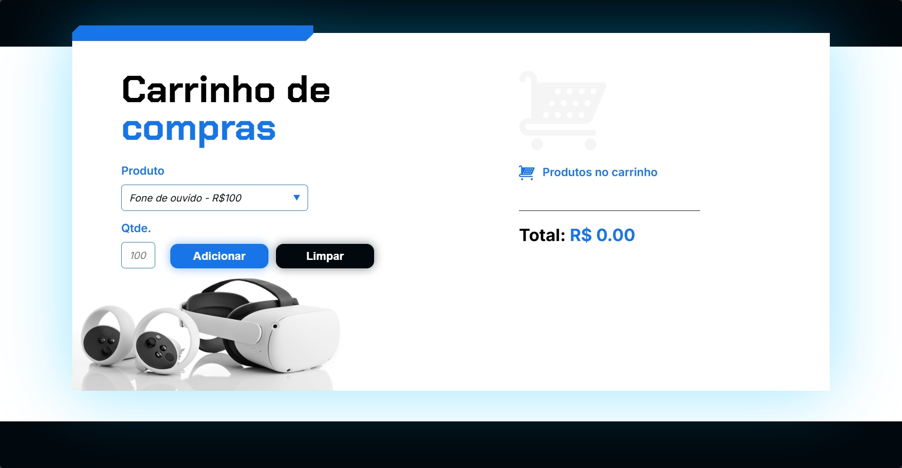

<h1 align="center">
  🛒 Carrinho de Compras — Oracle Next Education (ONE)
</h1>

<p align="center">
  
  
  
  
</p>

Projeto prático desenvolvido como parte da trilha de **Lógica de Programação e Manipulação do DOM com JavaScript**, integrado ao programa **Oracle Next Education (ONE)** em parceria com a **Alura**.

A aplicação simula o fluxo básico de um checkout de e-commerce client-side, permitindo a seleção de produtos através de um menu drop-down, especificação de quantidade, adição ao carrinho com cálculo automatizado de subtotais e exibição do valor total acumulado em tempo real.

<p align="center">  </p>

---

## 📌 Lógica de Programação & Operações no DOM

O motor lógico da aplicação (implementado em `js/app.js`) gerencia os dados e a interface adotando conceitos fundamentais de desenvolvimento web:

* **Parsing e Isolamento de Strings (`split`):** O sistema captura o valor bruto do elemento `<select>`. Através de manipulação de strings com o método `.split()`, a lógica separa o nome do produto do seu valor numérico predefinido, isolando o caractere de moeda para permitir operações matemáticas puras.
* **Injeção e Renderização Dinâmica:** Cada clique no botão *Adicionar* gera programaticamente um novo fragmento HTML de item de lista (`<section class="carrinho__produtos__produto">`). O sistema limpa o input de quantidade reativamente após a inserção bem-sucedida.
* **Acumuladores Dinâmicos de Estado:** O sistema mantém em memória uma variável global para o `valorTotal`. A cada nova adição, calcula-se o produto de `quantidade × precoUnitario`, somando o resultado ao montante global e atualizando a interface gráfica instantaneamente.
* **Reset de Ciclo Completo:** A função vinculada ao botão *Limpar* redefine todas as variáveis de controle de preço para zero e reinicia as tags de visualização para um estado vazio estruturado.

---

## 📂 Estrutura do Repositório

```text
carrinho-de-compras
├── assets/             # Vetores (SVGs) e imagens estáticas de suporte do layout
├── js/
│   └── app.js          # Camada de inteligência (lógica de parsing, DOM e acumuladores)
├── index.html          # Estrutura semântica e formulários da aplicação
└── style.css           # Estilização visual, variáveis de cor e tokens de layout

```

---

## 🚀 Como Executar o Projeto

Por se tratar de uma aplicação front-end client-side nativa, ela roda diretamente no ambiente do navegador sem a necessidade de servidores backend ou dependências de terminal:

1. Realize o clone deste repositório:
```bash
git clone https://github.com/cassia-nascimento/carrinho-de-compras.git

```


2. Acesse a pasta do projeto:
```bash
cd carrinho-de-compras

```


3. Abra o arquivo `index.html` diretamente em seu navegador web (Chrome, Firefox, Safari ou Edge).

---

## 👩‍💻 Autora

Projeto de consolidação de fundamentos JavaScript desenvolvido por **Cássia Nascimento**.

* [GitHub Profile](https://github.com/cassia-nascimento)
* [LinkedIn](https://www.linkedin.com/in/cassia--nascimento/)
